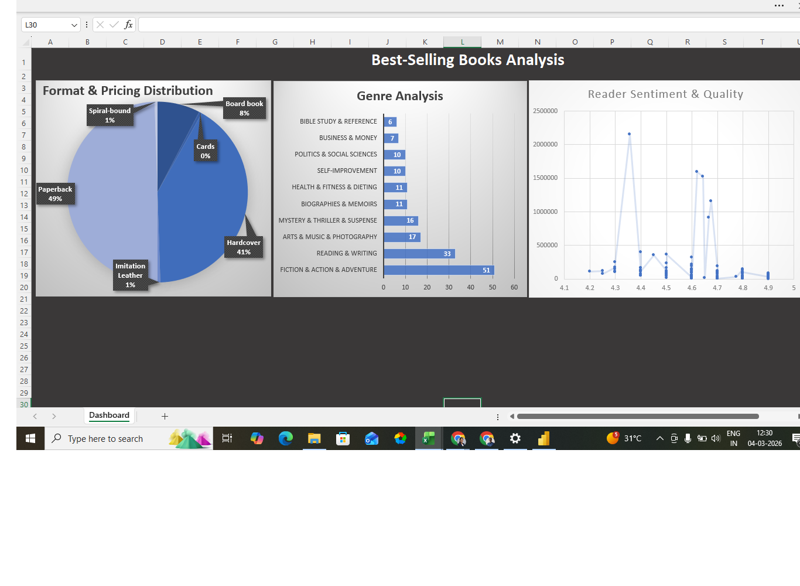

# Amazon Bestseller Books Analysis (Excel)

## Project Overview
This project presents a descriptive analysis of 210 Amazon bestseller books from 2023 to 2025. The analysis focuses on author dominance, pricing patterns, format preferences, and reader sentiment to understand current market trends and support publishing and inventory decisions.

## Objectives
- Identify top-performing authors and genres
- Analyze pricing differences across book formats
- Study the relationship between ratings and reader engagement
- Derive insights that support publishing strategy

## Key Findings
- Paperback accounts for 50.5% of the market share
- The 4.6 to 4.8 rating band appears to be the strongest commercial range
- The market is dominated by a small group of high-volume authors
- Higher review counts suggest stronger brand recognition and audience reach

## Tools Used
- Excel
- Pivot Tables
- Descriptive Statistics
- Segmentation Analysis

## Strategic Insights
- Focus on high-volume fiction authors for stronger market reach
- Promote niche books with high ratings for targeted audience segments
- Optimize paperback inventory strategy based on demand patterns

## Dashboard Preview

## Project Files
- Excel dashboard file
- Source dataset
- Dashboard image
- README.md

## Author
**Saranya D**  
Aspiring Data Analyst

## Tags
`Excel` `Data Analysis` `Dashboard` `Data Visualization` `Descriptive Analysis` `Pivot Tables` `Book Sales Analysis` `Amazon Books` `Market Analysis` `Portfolio Project`
